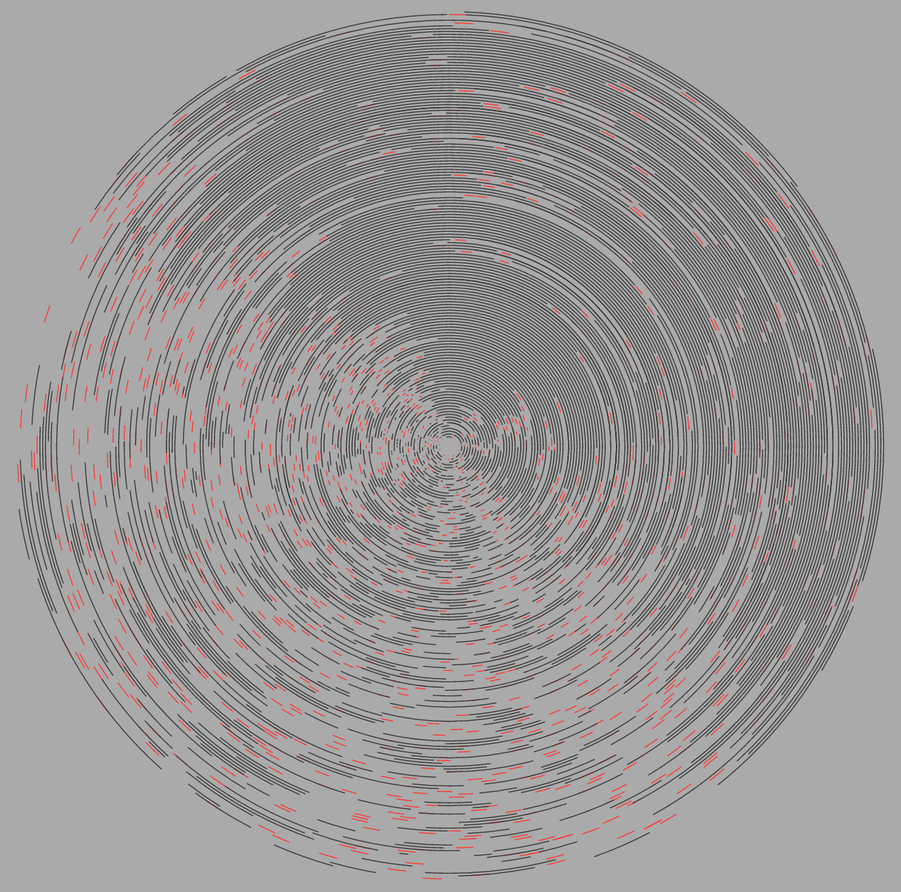

## Daily Patterns: A Simple Recurring Event Visualisation



You can view the content of this repo live [here](http://ewandennis.github.io/d3-daily-patterns/).

### Installation

Prerequisites:
 - Bower
 - A browser

Clone this repo and install the Bower packages:

```bash
git clone https://github.com/ewandennis/d3-daily-patterns
cd d3-daily-patterns
bower install
```

Arrange for an HTTP server to access the visualisation (because CORS):

```bash
npm install node-static -g
static -p 8000
```

[Open http://localhost:8000/ in your browser.](http://localhost:8000/)

### Notes

The detail of each arc can be distracting when loking for broad visual patterns.  Try uncommenting the blur filter in `main.css` to show large scale detail.

